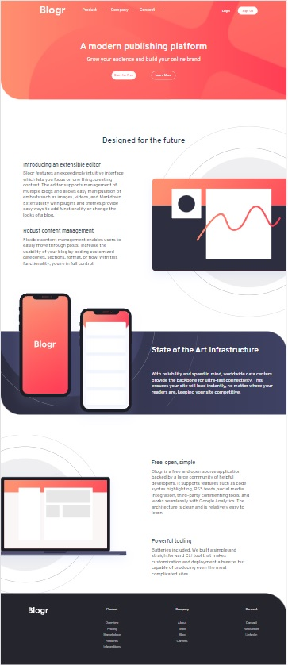

# Frontend Mentor - Blogr landing page solution

This is a solution to the [Blogr landing page challenge on Frontend Mentor](https://www.frontendmentor.io/challenges/blogr-landing-page-EX2RLAApP). Frontend Mentor challenges help you improve your coding skills by building realistic projects.

## Table of contents

- [Overview](#overview)
  - [The challenge](#the-challenge)
  - [Screenshot](#screenshot)
  - [Links](#links)
- [My process](#my-process)
  - [Built with](#built-with)
  - [What I learned](#what-i-learned)
  - [Continued development](#continued-development)
  - [Useful resources](#useful-resources)
- [Author](#author)

## Overview

### The challenge

Users should be able to:

- View the optimal layout for the site depending on their device's screen size
- See hover states for all interactive elements on the page

### Screenshot



### Links

- Live Site URL: [Netlify](https://blogr-landing-page-arthur.netlify.app/)

## My process

For this challenge, used mobile-first workflow, starting by the header part. The dropdown parts were really challenging for me, but after that it was all quite ok and simple.

### Built with

- Semantic HTML5 markup
- CSS custom properties
- Flexbox
- Absolute positioning
- Mobile-first workflow

### What I learned

I have learned how to make simple dropdown content as well as how to make the hamburguer button style dropbown with border and pseudo-elements. Could sharpen my CSS and Semantic HTML skills also.

To see how you can add code snippets, see below:

```css
.dropdown::after {
  content: "";
  background-image: url("/images/icon-arrow-light.svg");
  background-repeat: no-repeat;
  transform: rotate(0deg);
  position: absolute;
  right: -25px;
  top: 10px;
}
.dropdown__container:hover .dropdown::after {
  content: "";
  background-image: url("/images/icon-arrow-light.svg");
  background-repeat: no-repeat;
  transform: rotate(180deg);
  position: absolute;
  left: 85px;
  top: -13px;
}
```

```js
function content(event) {
  for (let i = 0; i < dropButton.length; i++) {
    if (event.target === dropButton[i]) {
      dropContent[i].classList.forEach((item) => {
        if (item == "dropdown-content-hidden") {
          dropContent[i].classList.remove("dropdown-content-hidden");
          dropContent[i].classList.add("dropdown-content-show");
        } else if (item == "dropdown-content-show") {
          dropContent[i].classList.remove("dropdown-content-show");
          dropContent[i].classList.add("dropdown-content-hidden");
        }
      });
    }
  }
}
```

### Continued development

I do want to sharpen even more my CSS skills and use more JavaScript in upcoming projects in the dropsown section. Learning the CSS dropdown at desktop version was pretty awesome.

### Useful resources

- [W3 Schools](https://www.w3schools.com/howto/tryit.asp?filename=tryhow_js_responsive_navbar_dropdown) - This helped me to understand how dropdown at the navbar, or in general, works. And how to code it.

## Author

- Linkedin - [arthur-mitsuo-081996](https://www.linkedin.com/in/arthur-mitsuo-081996/)
- Website - [GITHUB](https://github.com/ArthurMitsuo)
- Frontend Mentor - [@ArthurMitsuo](https://www.frontendmentor.io/profile/ArthurMitsuo)
- Twitter - [@arthur_mitsuo](https://twitter.com/arthur_mitsuo)
